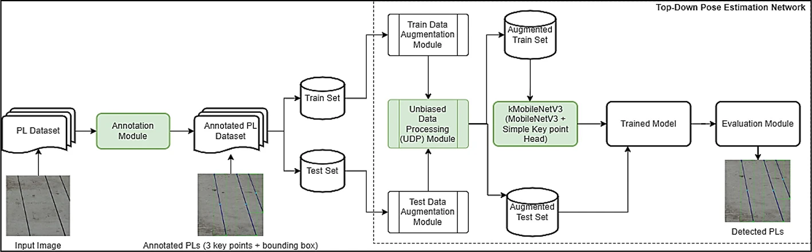
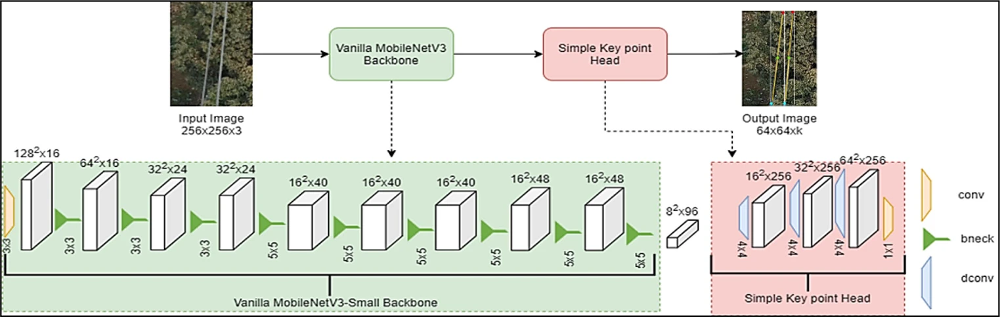
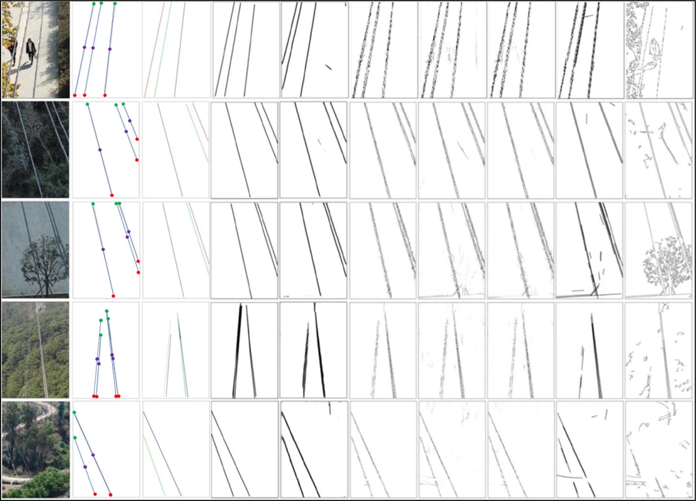
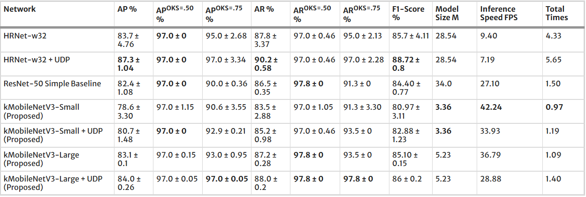
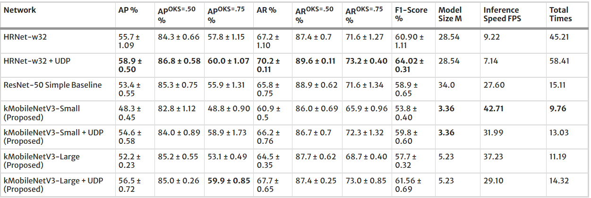
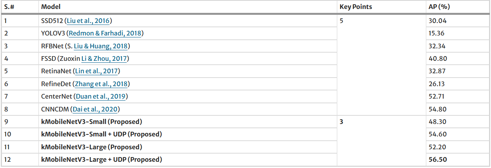
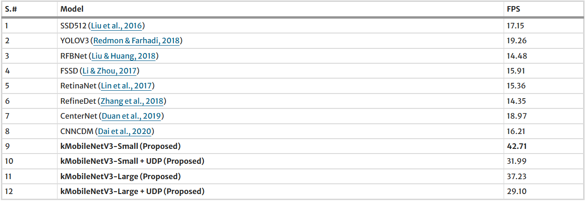

# PLPose: Efficient Power Line Detection via Keypoints-Based Pose Estimation

> **PhD Research (July 2019 – November 2022)**  
> Department of Computing, Universiti Teknologi PETRONAS, Malaysia

PLPose is a lightweight deep learning framework for accurate and real-time power line detection from UAV imagery using keypoints-based pose estimation.

---

# Overview

The inspection and maintenance of electrical power lines using unmanned aerial vehicles (UAVs) require fast and reliable power line detection to ensure safe and efficient operation of electrical infrastructure. However, detecting power lines from aerial imagery remains a challenging problem due to their thin structures, cluttered backgrounds, varying illumination, and complex environmental conditions.

PLPose addresses this challenge by reformulating power line detection as a **keypoints-based pose estimation** problem instead of conventional line detection or semantic segmentation. The proposed framework introduces **kMobileNetV3**, a lightweight adaptation of MobileNetV3 with a dedicated keypoint prediction head, enabling efficient localization of power lines while maintaining real-time performance.

To further improve localization accuracy, the framework integrates **Unbiased Data Processing (UDP)** and introduces novel annotation and evaluation strategies specifically designed for thin object detection. Extensive experiments on three benchmark datasets (PLDM, PLDU, and the Mendeley Powerline Dataset) demonstrate that PLPose achieves state-of-the-art detection performance while maintaining a compact architecture (**5.23M parameters**) and real-time inference speed of approximately **29 FPS**.

---

# Schematic Diagram and Framework Architecture

> *Schematic Diagram of the proposed PLPose framework.*

<p align="center">
  
</p>

> *Architecture of the proposed PLPose framework.*

<p align="center">
  
</p>

---

# Experimental Results

### Qualitative Results

> *Results on some sample images from PLD (PLDU + PLDM) dataset (From left to right: original image, proposed kMobileNetV3-Large + UDP model with the three key points: S (green), C (purple), E (red), modified PINet model (Sumagayan et al., 2021), CNNCDM, BDCN, CFSC, RCF, HED, Gestalt Grouping and Canny). Our model can detect the power lines using the connections between three key points only. The connections between the key points are estimated directly as pose of the PL from our proposed model.*

<p align="center">
  
</p>

---

### Benchmark Performance

> _Table 9 Experimental Results of various top-down pose estimation networks (HRNet-w32, HRNet-w32 + UDP, Resnet-50 Simple Baseline, and Proposed Approach (kMobileNetV3 and kMobileNetV3 + UDP)) on Mendeley PL Test Set (k = 3) with 40 Images._ 

<p align="center">
  
</p>

> *_Table 10 Experimental Results of various top-down pose estimation networks (HRNet-w32, HRNet-w32 + UDP, Resnet-50 Simple Baseline, and Proposed Approach (kMobileNetV3 and kMobileNetV3 + UDP)) on PLD Test Set (k = 3) with 170 Images_.*
> 
<p align="center">
  
</p>

> *_Table 11 Performance in average precision (AP) of Various Key Point Detectors on PLD Test Set with 170 Images._*
> 
<p align="center">
  
</p>

> *_Table 12 Processing Time in FPS of Various Key Point Detectors on PLD Test Set with 170 Images._*
> 
<p align="center">
  
</p>

---

# Technologies

- Python
- PyTorch
- MMPose Framework [Clickable Text](Available at: https://github.com/open-mmlab/mmpose)
- MobileNetV3
- Keypoints-Based Pose Estimation
- Unbiased Data Processing (UDP)
- Computer Vision
- Deep Learning
- UAV Image Analysis

---

# Research Contributions

- Proposed **PLPose**, a novel framework that formulates power line detection as a keypoints-based pose estimation problem.
- Developed **kMobileNetV3**, a lightweight architecture for efficient keypoint localization.
- Integrated **Unbiased Data Processing (UDP)** for improved localization accuracy.
- Introduced novel annotation and evaluation strategies for thin object detection.
- Achieved state-of-the-art detection performance with only **5.23M parameters** while operating at approximately **29 FPS**.

---

# Awards & Recognition

- 🥈 **Silver Award** — International Emerging Technology Competition, Universiti Teknologi PETRONAS, Malaysia (2021)
- 🥇 **Gold Award** — Thesis in 5 Minutes (T5M), MNNF Network, Malaysia (2021)
- 🥉 **Second Runner-up** — Thesis in 3 Minutes (3MT), Universiti Teknologi PETRONAS, Malaysia (2022)

---

# Publication & Citation

**PLPose: An Efficient Framework for Detecting Power Lines via Key Points-Based Pose Estimation**

*Journal of King Saud University – Computer and Information Sciences (2023)*

🔗 https://link.springer.com/article/10.1016/j.jksuci.2023.101615

If you use this repository in your research, please cite:

```bibtex
@article{jaffari2023plpose,
  title={PLPose: An Efficient Framework for Detecting Power Lines via Key Points-Based Pose Estimation},
  author={Jaffari, Rabeea and Hashmani, Manzoor Ahmed and Reyes-Aldasoro, Constantino Carlos and Junejo, Aisha Zahid and Abdullah, M. Nasir B.},
  journal={Journal of King Saud University - Computer and Information Sciences},
  year={2023},
  doi={10.1016/j.jksuci.2023.101615}
}
```

---

# Applications

PLPose can be applied to:

- Electrical power line inspection
- Smart grid monitoring
- UAV-based infrastructure inspection
- Autonomous aerial surveillance
- Intelligent utility maintenance

---

# License

This project is released under the MIT License.
